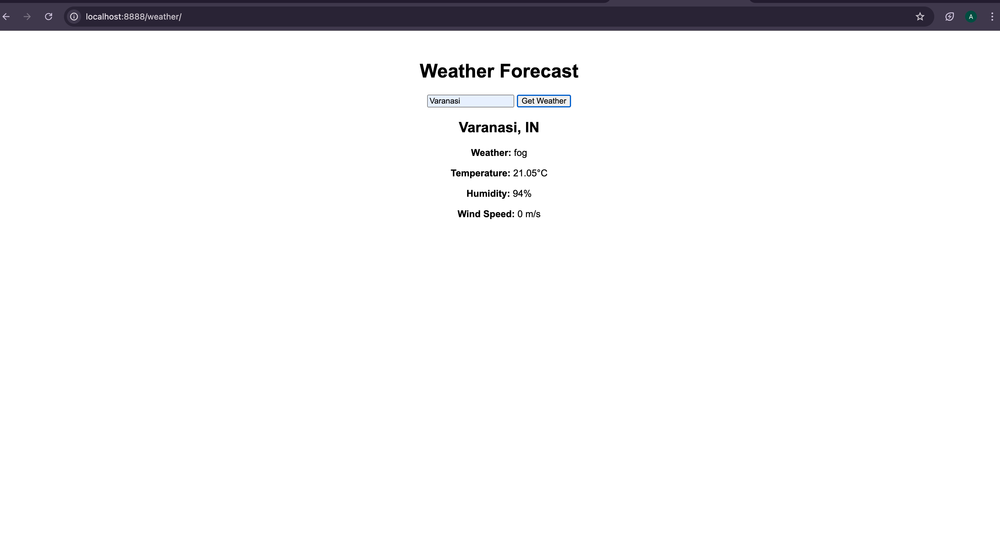
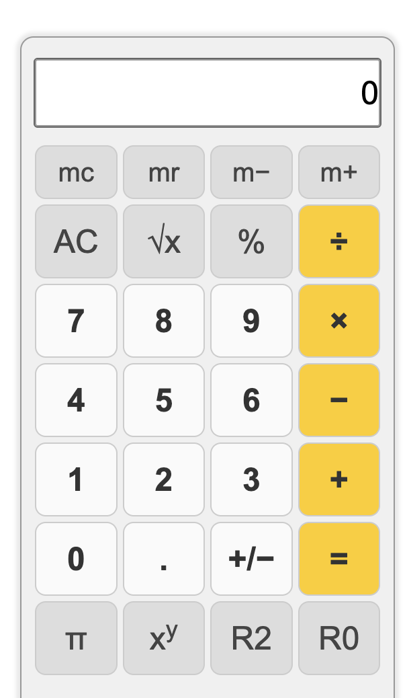
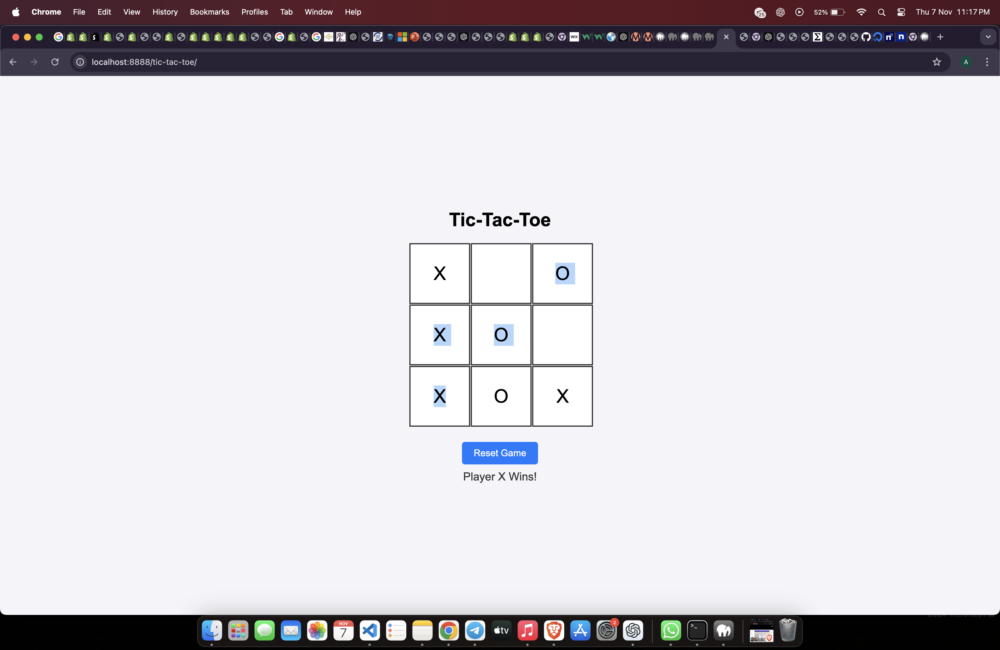
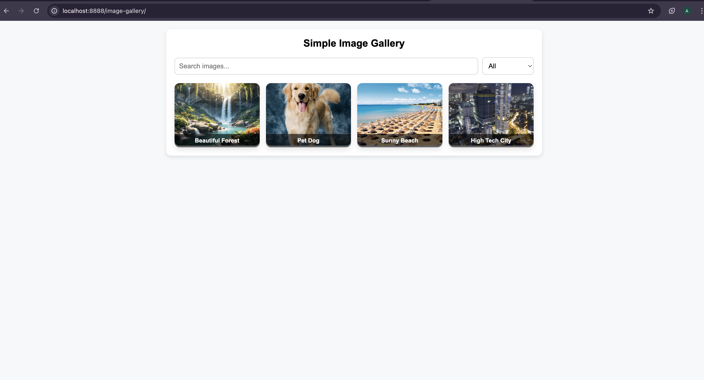

My Portfolio Projects
Welcome to my GitHub repository showcasing five beginner-level projects that demonstrate my skills in web development and JavaScript. Each project is designed to be interactive and user-friendly, focusing on different aspects of front-end development.

Project List
Weather App
Calculator
Tic-Tac-Toe
Image Gallery
Expense Tracker
1. Weather App
🌦️ Features
Fetches current weather data using a public API.
Displays temperature, humidity, and weather conditions.
Provides weather updates based on the user's location or a searched city.
🛠️ Technologies
HTML, CSS, JavaScript
OpenWeather API

🚀 How to Run
Clone the repository: git clone <https://github.com/sameerchaurasia3326/Simple-javascript-projects.git>
Open the weather-app folder and start index.html in your browser.
2. Calculator
🧮 Features
A simple, responsive calculator for basic arithmetic operations.
Supports addition, subtraction, multiplication, and division.
User-friendly and responsive design.
🛠️ Technologies
HTML, CSS, JavaScript

🚀 How to Run
Clone the repository: git clone <https://github.com/sameerchaurasia3326/Simple-javascript-projects.git>
Open the calculator folder and start index.html in your browser.
3. Tic-Tac-Toe
🎮 Features
A classic two-player Tic-Tac-Toe game.
Interactive UI with a simple, minimalist design.
Tracks player turns and displays the winner.
🛠️ Technologies
HTML, CSS, JavaScript

🚀 How to Run
Clone the repository: git clone <https://github.com/sameerchaurasia3326/Simple-javascript-projects.git>
Open the tic-tac-toe folder and start index.html in your browser.
4. Image Gallery
🖼️ Features
A simple image gallery where users can view, search, and filter images.
Clickable images that open in a lightbox for an enlarged view.
Supports category filtering and keyword search.
🛠️ Technologies
HTML, CSS, JavaScript

🚀 How to Run
Clone the repository: git clone <https://github.com/sameerchaurasia3326/Simple-javascript-projects.git>
Open the image-gallery folder and start index.html in your browser.
5. Expense Tracker
💰 Features
Allows users to track their daily expenses.
Provides a summary of total income and expenses.
User-friendly UI for adding and removing expense items.
🛠️ Technologies
HTML, CSS, JavaScript

🚀 How to Run
Clone the repository: git clone <https://github.com/sameerchaurasia3326/Simple-javascript-projects.git>
Open the expense-tracker folder and start index.html in your browser.
📌 How to Clone the Repository
bash
Copy code
git clone <https://github.com/sameerchaurasia3326/Simple-javascript-projects.git>
cd <project-name>
Feel free to explore each project and provide feedback. Your contributions and suggestions are welcome!

📞 Contact
If you have any questions or want to connect, feel free to reach out:

GitHub: Your GitHub Profile
Email: your-email@example.com